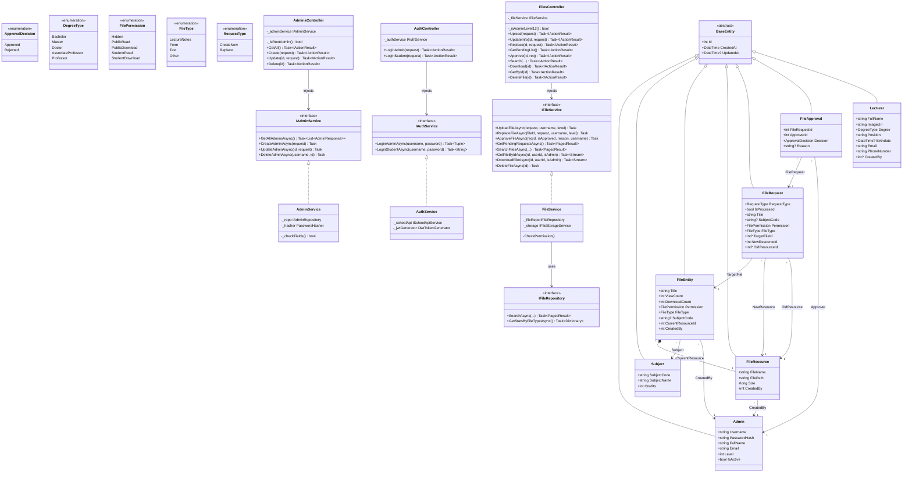
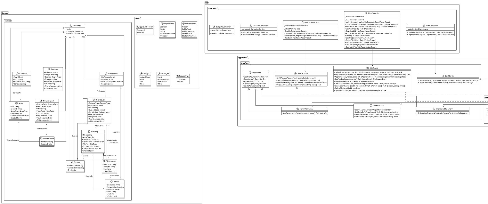
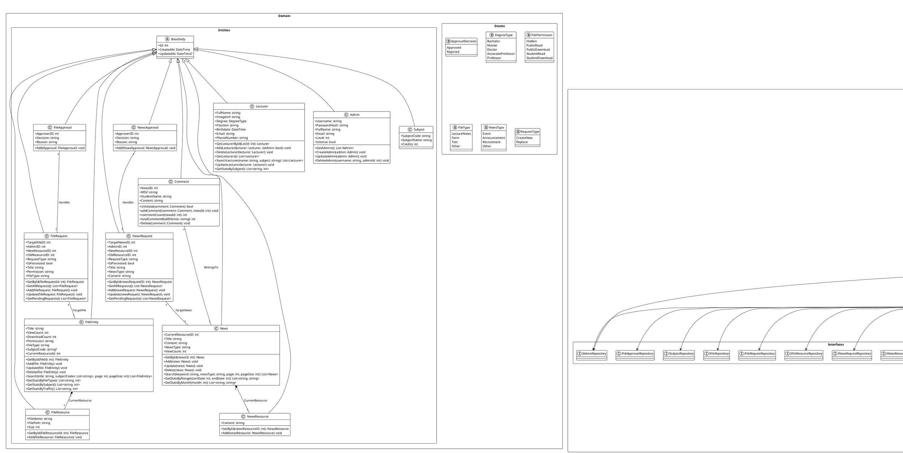

# Class Diagram

## Mermaid Version

```mermaid
classDiagram

    %% ==============================
    %% ENUMS
    %% ==============================
    class ApprovalDecision {
        <<enumeration>>
        Approved
        Rejected
    }
    class DegreeType {
        <<enumeration>>
        Bachelor
        Master
        Doctor
        AssociateProfessor
        Professor
    }
    class FilePermission {
        <<enumeration>>
        Hidden
        PublicRead
        PublicDownload
        StudentRead
        StudentDownload
    }
    class FileType {
        <<enumeration>>
        LectureNotes
        Form
        Test
        Other
    }
    class RequestType {
        <<enumeration>>
        CreateNew
        Replace
    }

    %% ==============================
    %% DOMAIN ENTITIES
    %% ==============================
    class BaseEntity {
        <<abstract>>
        +int Id
        +DateTime CreatedAt
        +DateTime? UpdatedAt
    }

    class Admin {
        +string Username
        +string PasswordHash
        +string FullName
        +string Email
        +int Level
        +bool IsActive
    }

    class Subject {
        +string SubjectCode
        +string SubjectName
        +int Credits
    }

    class FileEntity {
        +string Title
        +int ViewCount
        +int DownloadCount
        +FilePermission Permission
        +FileType FileType
        +string? SubjectCode
        +int CurrentResourceId
        +int CreatedBy
    }

    class FileResource {
        +string FileName
        +string FilePath
        +long Size
        +int CreatedBy
    }

    class FileRequest {
        +RequestType RequestType
        +bool IsProcessed
        +string Title
        +string? SubjectCode
        +FilePermission Permission
        +FileType FileType
        +int? TargetFileId
        +int NewResourceId
        +int? OldResourceId
    }

    class FileApproval {
        +int FileRequestId
        +int ApproverId
        +ApprovalDecision Decision
        +string? Reason
    }
    
    class Lecturer {
        +string FullName
        +string ImageUrl
        +DegreeType Degree
        +string Position
        +DateTime? Birthdate
        +string Email
        +string PhoneNumber
        +int? CreatedBy
    }

    BaseEntity <|-- Admin
    BaseEntity <|-- Subject
    BaseEntity <|-- FileEntity
    BaseEntity <|-- FileResource
    BaseEntity <|-- FileRequest
    BaseEntity <|-- FileApproval
    BaseEntity <|-- Lecturer

    %% Relationships
    FileEntity "1" *-- "1" FileResource : CurrentResource
    FileEntity "*" --> "1" Subject : Subject
    FileEntity "*" --> "1" Admin : CreatedBy
    FileResource "*" --> "1" Admin : CreatedBy
    FileRequest "*" --> "1" FileEntity : TargetFile
    FileRequest "*" --> "1" FileResource : NewResource
    FileRequest "*" --> "1" FileResource : OldResource
    FileApproval "*" --> "1" FileRequest : FileRequest
    FileApproval "*" --> "1" Admin : Approver

    %% ==============================
    %% INTERFACES
    %% ==============================
    class IAdminService {
        <<interface>>
        +GetAllAdminsAsync() Task~List~AdminResponse~~
        +CreateAdminAsync(request) Task
        +UpdateAdminAsync(id, request) Task
        +DeleteAdminAsync(username, id) Task
    }

    class IAuthService {
        <<interface>>
        +LoginAdminAsync(username, password) Task~Tuple~
        +LoginStudentAsync(username, password) Task~string~
    }

    class IFileService {
        <<interface>>
        +UploadFileAsync(request, username, level) Task
        +ReplaceFileAsync(fileId, request, username, level) Task
        +ApproveFileAsync(reqId, isApproved, reason, username) Task
        +GetPendingRequestsAsync() Task~PagedResult~
        +SearchFilesAsync(...) Task~PagedResult~
        +GetFileByIdAsync(id, userId, isAdmin) Task~Stream~
        +DownloadFileAsync(id, userId, isAdmin) Task~Stream~
        +DeleteFileAsync(id) Task
    }

    class IFileRepository {
        <<interface>>
        +SearchAsync(...) Task~PagedResult~
        +GetStatsByFileTypeAsync() Task~Dictionary~
    }

    %% ==============================
    %% SERVICES (IMPLEMENTATION)
    %% ==============================
    class AdminService {
        -_repo IAdminRepository
        -_hasher PasswordHasher
        -_checkFields() bool
    }
    class AuthService {
        -_schoolApi ISchoolApiService
        -_jwtGenerator IJwtTokenGenerator
    }
    class FileService {
        -_fileRepo IFileRepository
        -_storage IFileStorageService
        -CheckPermission()
    }

    IAdminService <|.. AdminService
    IAuthService <|.. AuthService
    IFileService <|.. FileService
    
    FileService --> IFileRepository : uses

    %% ==============================
    %% CONTROLLERS (API LAYER)
    %% ==============================
    class AdminsController {
        -_adminService IAdminService
        -_isRootAdmin() bool
        +GetAll() Task~IActionResult~
        +Create(request) Task~IActionResult~
        +Update(id, request) Task~IActionResult~
        +Delete(id) Task~IActionResult~
    }

    class AuthController {
        -_authService IAuthService
        +LoginAdmin(request) Task~IActionResult~
        +LoginStudent(request) Task~IActionResult~
    }

    class FilesController {
        -_fileService IFileService
        -_isAdminLevel12() bool
        +Upload(request) Task~IActionResult~
        +UpdateInfo(id, request) Task~IActionResult~
        +Replace(id, request) Task~IActionResult~
        +GetPendingList() Task~IActionResult~
        +Approve(id, req) Task~IActionResult~
        +Search(...) Task~IActionResult~
        +Download(id) Task~IActionResult~
        +GetById(id) Task~IActionResult~
        +DeleteFile(id) Task~IActionResult~
    }

    AdminsController --> IAdminService : injects
    AuthController --> IAuthService : injects
    FilesController --> IFileService : injects
```

## PlantUML Version

```plantuml
@startuml KhoaCNTT_ClassDiagram
!theme plain
skinparam classAttributeIconSize 0
skinparam linetype ortho
skinparam nodesep 50
skinparam ranksep 50

' ==============================
' ENUMS
' ==============================
package "Domain.Enums" {
    enum ApprovalDecision {
        Approved
        Rejected
    }
    enum DegreeType {
        Bachelor
        Master
        Doctor
        AssociateProfessor
        Professor
    }
    enum FilePermission {
        Hidden
        PublicRead
        PublicDownload
        StudentRead
        StudentDownload
    }
    enum FileType {
        LectureNotes
        Form
        Test
        Other
    }
    enum NewsType {
        Event
        Announcement
        Recruitment
        Other
    }
    enum RequestType {
        CreateNew
        Replace
    }
}

' ==============================
' DOMAIN ENTITIES
' ==============================
package "Domain.Entities" {
    abstract class BaseEntity {
        + Id: int
        + CreatedAt: DateTime
        + UpdatedAt: DateTime?
    }

    class Admin {
        + Username: string
        + PasswordHash: string
        + FullName: string
        + Email: string
        + Level: int
        + IsActive: bool
    }

    class Subject {
        + SubjectCode: string
        + SubjectName: string
        + Credits: int
    }

    class FileEntity {
        + Title: string
        + ViewCount: int
        + DownloadCount: int
        + Permission: FilePermission
        + FileType: FileType
        + SubjectCode: string?
        + CurrentResourceId: int
        + CreatedBy: int
    }

    class FileResource {
        + FileName: string
        + FilePath: string
        + Size: long
        + CreatedBy: int
    }

    class FileRequest {
        + RequestType: RequestType
        + IsProcessed: bool
        + Title: string
        + SubjectCode: string?
        + Permission: FilePermission
        + FileType: FileType
        + TargetFileId: int?
        + NewResourceId: int
        + OldResourceId: int?
    }

    class FileApproval {
        + FileRequestId: int
        + ApproverId: int
        + Decision: ApprovalDecision
        + Reason: string?
    }
    
    class News {
        + Title: string
        + Content: string
        + NewsType: NewsType
        + ViewCount: int
        + CurrentResourceID: int
        + CreatedBy: int
    }
    
    class NewsResource {
        + Content: string
        + CreatedBy: int
    }
    
    class NewsRequest {
        + RequestType: RequestType
        + IsProcessed: bool
        + Title: string
        + NewsType: NewsType
        + Content: string
        + TargetNewsID: int?
        + NewResourceID: int
        + OldResourceID: int?
    }
    
    class Comment {
        + NewsID: int
        + MSV: string
        + StudentName: string
        + Content: string
    }
    
    class Lecturer {
        + FullName: string
        + ImageUrl: string
        + Degree: DegreeType
        + Position: string
        + Birthdate: DateTime?
        + Email: string
        + PhoneNumber: string
        + CreatedBy: int?
    }

    BaseEntity <|-- Admin
    BaseEntity <|-- Subject
    BaseEntity <|-- FileEntity
    BaseEntity <|-- FileResource
    BaseEntity <|-- FileRequest
    BaseEntity <|-- FileApproval
    BaseEntity <|-- News
    BaseEntity <|-- NewsResource
    BaseEntity <|-- NewsRequest
    BaseEntity <|-- Comment
    BaseEntity <|-- Lecturer

    FileEntity "1" *-- "1" FileResource : CurrentResource
    FileEntity "*" -- "1" Subject : Subject
    FileEntity "*" -- "1" Admin : CreatedBy

    FileResource "*" -- "1" Admin : CreatedBy

    FileRequest "*" -- "1" FileEntity : TargetFile
    FileRequest "*" -- "1" FileResource : NewResource
    FileRequest "*" -- "1" FileResource : OldResource
    FileRequest "*" -- "1" Subject : Subject

    FileApproval "*" -- "1" FileRequest : FileRequest
    FileApproval "*" -- "1" Admin : Approver
    
    News "*" -- "1" NewsResource : CurrentResource
    NewsRequest "*" -- "1" NewsResource : NewResource
    Comment "*" -- "1" News : BelongsTo
}

' ==============================
' INTERFACES (SERVICES & REPOS)
' ==============================
package "Application.Interfaces" {
    interface "IRepository<T>" as IRepository {
        + GetByIdAsync(id: int): Task<T?>
        + GetAllAsync(): Task<List<T>>
        + AddAsync(entity: T): Task
        + UpdateAsync(entity: T): Task
        + DeleteAsync(entity: T): Task
    }

    interface IAdminRepository {
        + GetByUsernameAsync(username: string): Task<Admin?>
    }
    interface IFileRepository {
        + SearchAsync(...): Task<PagedResult<FileEntity>>
        + GetStatsByFileTypeAsync(): Task<Dictionary<string, int>>
        + GetStatsBySubjectAsync(): Task<Dictionary<string, int>>
        + GetStatsByTrafficAsync(): Task<Dictionary<string, int>>
    }
    interface IFileRequestRepository {
        + GetPendingRequestsWithDetailsAsync(): Task<List<FileRequest>>
    }
    
    IRepository <|-- IAdminRepository
    IRepository <|-- IFileRepository
    IRepository <|-- IFileRequestRepository

    interface IAdminService {
        + GetAllAdminsAsync(): Task<List<AdminResponse>>
        + CreateAdminAsync(request: CreateAdminRequest): Task
        + UpdateAdminAsync(id: int, request: UpdateAdminRequest): Task
        + DeleteAdminAsync(currentUsername: string, id: int): Task
    }

    interface IAuthService {
        + LoginAdminAsync(username: string, password: string): Task<(string, string)>
        + LoginStudentAsync(username: string, password: string): Task<string>
    }

    interface IFileService {
        + UploadFileAsync(request: UploadFileRequest, username: string, adminLevel: int): Task
        + ReplaceFileAsync(fileId: int, request: UploadFileRequest, username: string, adminLevel: int): Task
        + ApproveFileAsync(requestId: int, isApproved: bool, reason: string?, username: string): Task
        + GetPendingRequestsAsync(): Task<PagedResult<FileRequestDto>>
        + SearchFilesAsync(...): Task<PagedResult<FileDto>>
        + GetFileByIdAsync(id: int, userId: string?, isAdmin: bool): Task<(Stream, string)>
        + DownloadFileAsync(fileId: int, userId: string?, isAdmin: bool): Task<(Stream, string, string)>
        + DeleteFileAsync(fileId: int): Task
        + UpdateFileInfoAsync(fileId: int, request: UpdateFileRequest): Task
    }
}

' ==============================
' SERVICES (IMPLEMENTATION)
' ==============================
package "Application.Services" {
    class AdminService {
        - _repo: IAdminRepository
        - _hasher: PasswordHasher
        - _checkFields(...)
    }
    class AuthService {
        - _schoolApi: ISchoolApiService
        - _jwtGenerator: IJwtTokenGenerator
        - _adminRepo: IAdminRepository
    }
    class FileService {
        - _fileRepo: IFileRepository
        - _requestRepo: IFileRequestRepository
        - _resourceRepo: IFileResourceRepository
        - _approvalRepo: IFileApprovalRepository
        - _storage: IFileStorageService
        - CheckPermission(...)
        - GetContentType(fileName: string): string
    }

    IAdminService <|.. AdminService
    IAuthService <|.. AuthService
    IFileService <|.. FileService
    
    AdminService --> IAdminRepository
    FileService --> IFileRepository
    FileService --> IFileRequestRepository
}

' ==============================
' CONTROLLERS (API LAYER)
' ==============================
package "API.Controllers" {
    class AdminsController {
        - _adminService: IAdminService
        - _isRootAdmin(): bool
        + GetAll(): Task<IActionResult>
        + Create(request: CreateAdminRequest): Task<IActionResult>
        + Update(id: int, request: UpdateAdminRequest): Task<IActionResult>
        + Delete(id: int): Task<IActionResult>
    }

    class AuthController {
        - _authService: IAuthService
        + LoginAdmin(request: LoginRequest): Task<IActionResult>
        + LoginStudent(request: LoginRequest): Task<IActionResult>
    }

    class FilesController {
        - _fileService: IFileService
        - _isAdminLevel12(): bool
        + Upload(request: UploadFileRequest): Task<IActionResult>
        + UpdateInfo(id: int, request: UpdateFileRequest): Task<IActionResult>
        + Replace(id: int, request: UploadFileRequest): Task<IActionResult>
        + GetPendingList(): Task<IActionResult>
        + Download(id: int): Task<IActionResult>
        + Approve(id: int, req: ApproveRequest): Task<IActionResult>
        + Search(...): Task<IActionResult>
        + GetById(id: int): Task<IActionResult>
        + DeleteFile(id: int): Task<IActionResult>
        + GetStatsByFileType(): Task<IActionResult>
        + GetStatsBySubject(): Task<IActionResult>
        + GetStatsByTraffic(): Task<IActionResult>
    }

    class StudentsController {
        - _schoolApi: ISchoolApiService
        + GetGrades(): Task<IActionResult>
        + GetSchedule(id: string): Task<IActionResult>
    }

    class SubjectsController {
        - _repo: ISubjectRepository
        + GetAll(): Task<IActionResult>
    }

    AdminsController --> IAdminService
    AuthController --> IAuthService
    FilesController --> IFileService
}

@enduml
```

## PlantUML Version 2

```plantuml
@startuml KhoaCNTT_Full_ClassDiagram
!theme plain
skinparam classAttributeIconSize 0
skinparam nodesep 40
skinparam ranksep 60
skinparam packageStyle rectangle

' ==============================
' ENUMS
' ==============================
package "Domain.Enums" {
    enum ApprovalDecision {
        Approved
        Rejected
    }
    enum DegreeType {
        Bachelor
        Master
        Doctor
        AssociateProfessor
        Professor
    }
    enum FilePermission {
        Hidden
        PublicRead
        PublicDownload
        StudentRead
        StudentDownload
    }
    enum FileType {
        LectureNotes
        Form
        Test
        Other
    }
    enum NewsType {
        Event
        Announcement
        Recruitment
        Other
    }
    enum RequestType {
        CreateNew
        Replace
    }
}

' ==============================
' DOMAIN ENTITIES
' ==============================
package "Domain.Entities" {
    abstract class BaseEntity {
        + Id: int
        + CreatedAt: DateTime
        + UpdatedAt: DateTime?
    }

    class Admin {
        + Username: string
        + PasswordHash: string
        + FullName: string
        + Email: string
        + Level: int
        + IsActive: bool
        + GetAdmins(): List<Admin>
        + CreateAdmin(admin: Admin): void
        + UpdateAdmin(admin: Admin): void
        + DeleteAdmin(username: string, adminId: int): void
    }

    class Subject {
        + SubjectCode: string
        + SubjectName: string
        + Credits: int
    }

    class FileEntity {
        + Title: string
        + ViewCount: int
        + DownloadCount: int
        + Permission: string
        + FileType: string
        + SubjectCode: string?
        + CurrentResourceId: int
        + GetById(fileId: int): FileEntity
        + Add(file: FileEntity): void
        + Update(file: FileEntity): void
        + Delete(file: FileEntity): void
        + Search(title: string, subjectCodes: List<string>, page: int, pageSize: int): List<FileEntity>
        + GetStatsByFileType(): List<string, int>
        + GetStatsBySubject(): List<string, int>
        + GetStatsByTraffic(): List<string, int>
    }

    class FileResource {
        + FileName: string
        + FilePath: string
        + Size: int
        + GetById(fileResourceId: int): FileResource
        + Add(fileResource: FileResource): void
    }

    class FileRequest {
        + TargetFileID: int
        + AdminID: int
        + NewResourceID: int
        + OldResourceID: int
        + RequestType: string
        + IsProcessed: bool
        + Title: string
        + Permission: string
        + FileType: string
        + GetById(fileRequestId: int): FileRequest
        + GetAllRequests(): List<FileRequest>
        + Add(fileRequest: FileRequest): void
        + Update(fileRequest: FileRequest): void
        + GetPendingRequests(): List<FileRequest>
    }

    class FileApproval {
        + ApproverID: int
        + Decision: string
        + Reason: string
        + Add(Approval: FileApproval): void
    }
    
    class News {
        + CurrentResourceID: int
        + Title: string
        + Content: string
        + NewsType: string
        + ViewCount: int
        + GetById(newsId: int): News
        + Add(news: News): void
        + Update(news: News): void
        + Delete(news: News): void
        + Search(keyword: string, newsType: string, page: int, pageSize: int): List<News>
        + GetStatsByRange(startDate: int, endDate: int): List<string, string>
        + GetStatsByMonth(month: int): List<string, string>
    }
    
    class NewsResource {
        + Content: string
        + GetById(newsResourceID: int): NewsResource
        + Add(newsResource: NewsResource): void
    }
    
    class NewsRequest {
        + TargetNewsID: int
        + AdminID: int
        + NewResourceID: int
        + OldResourceID: int
        + RequestType: string
        + IsProcessed: bool
        + Title: string
        + NewsType: string
        + Content: string
        + GetById(newsRequestID: int): NewsRequest
        + GetAllRequests(): List<NewsRequest>
        + Add(newsRequest: NewsRequest): void
        + Update(newsRequest: NewsRequest): void
        + GetPendingRequests(): List<NewsRequest>
    }

    class NewsApproval {
        + ApproverID: int
        + Decision: string
        + Reason: string
        + Add(NewsApproval: NewsApproval): void
    }
    
    class Comment {
        + NewsID: int
        + MSV: string
        + StudentName: string
        + Content: string
        + isViolate(comment: Comment): bool
        + addComment(comment: Comment, newsId: int): void
        + commentCount(newsId: int): int
        + totalCommentByMSV(msv: string): int
        + Delete(comment: Comment): void
    }
    
    class Lecturer {
        + FullName: string
        + ImageUrl: string
        + Degree: DegreeType
        + Position: string
        + Birthdate: DateTime
        + Email: string
        + PhoneNumber: string
        + GetLecturerById(LecId: int): Lecturer
        + AddLecturer(lecturer: Lecturer, isAdmin: bool): void
        + DeleteLecturer(lecturer: Lecturer): void
        + GetLecturers(): List<Lecturer>
        + SearchLecturer(name: string, subject: string): List<Lecturer>
        + UpdateLecturer(lecturer: Lecturer): void
        + GetStatsBySubject(): List<string, int>
    }

    BaseEntity <|-- Admin
    BaseEntity <|-- Subject
    BaseEntity <|-- FileEntity
    BaseEntity <|-- FileResource
    BaseEntity <|-- FileRequest
    BaseEntity <|-- FileApproval
    BaseEntity <|-- News
    BaseEntity <|-- NewsResource
    BaseEntity <|-- NewsRequest
    BaseEntity <|-- NewsApproval
    BaseEntity <|-- Comment
    BaseEntity <|-- Lecturer

    FileEntity "1" *-- "1" FileResource : CurrentResource
    FileRequest "*" -- "1" FileEntity : TargetFile
    FileApproval "*" -- "1" FileRequest : Handles
    
    News "1" *-- "1" NewsResource : CurrentResource
    NewsRequest "*" -- "1" News : TargetNews
    NewsApproval "*" -- "1" NewsRequest : Handles
    Comment "*" -- "1" News : BelongsTo
}

' ==============================
' DTOs (DATA TRANSFER OBJECTS)
' ==============================
package "Application.DTOs" {
    class PagedResult<T> {
        + Total: int
        + Items: List<T>
    }

    package "Admin DTOs" {
        class AdminResponse {
            + Id: int
            + Username: string
            + FullName: string
            + Email: string
            + Level: int
            + isActive: int
        }
        class CreateAdminRequest {
            + Username: string
            + Password: string
            + FullName: string
            + Email: string
            + Level: int
        }
        class UpdateAdminRequest {
            + FullName: string?
            + Email: string?
            + Password: string?
            + Level: int?
            + IsActive: bool?
        }
        class LoginRequest {
            + Username: string
            + Password: string
        }
    }

    package "File DTOs" {
        class FileDto {
            + Id: int
            + Title: string
            + FileName: string
            + SubjectName: string
            + Permission: FilePermission
            + ViewCount: int
            + DownloadCount: int
        }
        class UploadFileRequest {
            + Title: string
            + File: IFormFile
            + SubjectCode: string?
            + Permission: FilePermission
            + FileType: FileType
        }
        class UpdateFileRequest {
            + Title: string?
            + SubjectCode: string?
            + Permission: FilePermission
            + FileType: FileType
        }
        class FileRequestDto {
            + Id: int
            + Type: RequestType
            + Title: string
            + NewFileName: string
            + RequesterName: string
        }
    }

    package "News & Lecturer DTOs" {
        class CreateNewsRequest {
            + Title: string
            + Content: string
            + NewsType: NewsType
        }
        class NewsResponse {
            + Id: int
            + Title: string
            + Content: string
            + NewsType: NewsType
            + ViewCount: int
        }
        class CreateLecturerRequest {
            + FullName: string
            + Degree: DegreeType
            + Email: string
        }
        class LecturerResponse {
            + Id: int
            + FullName: string
            + Degree: string
            + Position: string
        }
    }
}

' ==============================
' INTERFACES (REPOSITORIES)
' ==============================
package "Application.Interfaces" {
    interface IAdminRepository
    interface ISubjectRepository
    
    interface IFileRepository
    interface IFileRequestRepository
    interface IFileResourceRepository
    interface IFileApprovalRepository

    interface INewsRepository
    interface INewsRequestRepository
    interface INewsResourceRepository
    interface INewsApprovalRepository
    
    interface ICommentRepository
    interface ILecturerRepository
}

' ==============================
' SERVICES (LOGIC & IMPL)
' ==============================
package "Application.Services" {
    interface IAdminService
    class AdminService
    IAdminService <|.. AdminService
    
    interface IAuthService
    class AuthService
    IAuthService <|.. AuthService

    interface IFileService
    class FileService
    IFileService <|.. FileService

    interface INewsService
    class NewsService
    INewsService <|.. NewsService

    interface ILecturerService
    class LecturerService
    ILecturerService <|.. LecturerService
    
    interface ISchoolApiService

    ' Dependencies (Services using Repositories)
    AdminService --> IAdminRepository
    
    AuthService --> IAdminRepository
    AuthService --> ISchoolApiService

    FileService --> IFileRepository
    FileService --> IFileRequestRepository
    FileService --> IFileResourceRepository
    FileService --> IFileApprovalRepository
    FileService --> ISubjectRepository

    NewsService --> INewsRepository
    NewsService --> INewsRequestRepository
    NewsService --> INewsResourceRepository
    NewsService --> INewsApprovalRepository
    NewsService --> ICommentRepository

    LecturerService --> ILecturerRepository
}

' ==============================
' CONTROLLERS (API LAYER)
' ==============================
package "API.Controllers" {
    class AdminsController {
        - _adminService: IAdminService
        + GetAll(): Task<IActionResult>
        + Create(request: CreateAdminRequest): Task<IActionResult>
        + Update(id: int, request: UpdateAdminRequest): Task<IActionResult>
        + Delete(id: int): Task<IActionResult>
    }

    class AuthController {
        - _authService: IAuthService
        + LoginAdmin(request: LoginRequest): Task<IActionResult>
        + LoginStudent(request: LoginRequest): Task<IActionResult>
    }

    class FilesController {
        - _fileService: IFileService
        + Upload(request: UploadFileRequest): Task<IActionResult>
        + UpdateInfo(id: int, request: UpdateFileRequest): Task<IActionResult>
        + Replace(id: int, request: UploadFileRequest): Task<IActionResult>
        + GetPendingList(): Task<IActionResult>
        + Download(id: int): Task<IActionResult>
        + Approve(id: int, req: ApproveRequest): Task<IActionResult>
        + Search(...): Task<IActionResult>
        + GetById(id: int): Task<IActionResult>
        + DeleteFile(id: int): Task<IActionResult>
    }
    
    class NewsController {
        - _newsService: INewsService
        + CreateNews(request: CreateNewsRequest): Task<IActionResult>
        + UpdateNews(id: int, request: UpdateNewsRequest): Task<IActionResult>
        + DeleteNews(id: int): Task<IActionResult>
        + ApproveNews(id: int): Task<IActionResult>
        + GetNewsById(id: int): Task<IActionResult>
        + SearchNews(...): Task<IActionResult>
    }

    class LecturersController {
        - _lecturerService: ILecturerService
        + GetAllLecturers(): Task<IActionResult>
        + CreateLecturer(request: CreateLecturerRequest): Task<IActionResult>
        + UpdateLecturer(id: int, request: UpdateLecturerRequest): Task<IActionResult>
        + DeleteLecturer(id: int): Task<IActionResult>
    }

    class StudentsController {
        - _schoolApi: ISchoolApiService
        + GetGrades(): Task<IActionResult>
        + GetSchedule(id: string): Task<IActionResult>
    }

    ' Dependencies (Controllers using Services)
    AdminsController --> IAdminService
    AuthController --> IAuthService
    FilesController --> IFileService
    NewsController --> INewsService
    LecturersController --> ILecturerService
    StudentsController --> ISchoolApiService
}

@enduml
```
